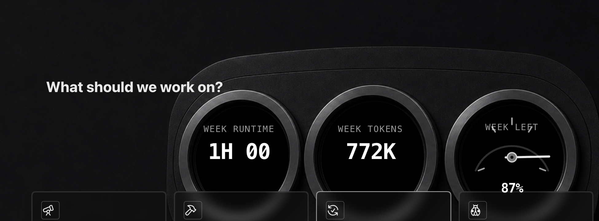
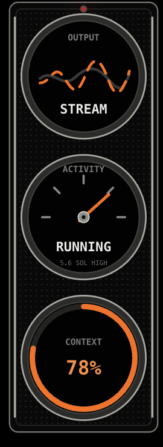

# Codex Luce

**首个动态三连表 Codex 皮肤。**

Codex Luce turns the official Codex Desktop app into a dark mechanical cockpit with live, read-only instrumentation. The home surface carries a horizontal three-gauge dashboard, while task threads reveal a vertical three-gauge dock for `OUTPUT`, `ACTIVITY`, and `CONTEXT`.

The visual language references the three-dial composition of Ferrari Luce concept interiors and the transparent, dot-matrix, mechanical interface spirit often associated with Nothing. It does not use Ferrari, Nothing, OpenAI, or Codex official logos, marks, product assets, or endorsement.

> Unofficial project. Not affiliated with, endorsed by, or sponsored by OpenAI, Ferrari, or Nothing.





## What Makes It Different

- Dynamic three-gauge skin for Codex, built around live work-state instrumentation.
- Ferrari Luce-inspired triple dial layout, adapted for AI coding workflows.
- Nothing-inspired black glass, orange signal color, dot matrix texture, and mechanical restraint.
- Native Codex controls stay real and interactive; the gauges are read-only overlays.
- No patching of the official `.app`, `app.asar`, or code signature.

## Requirements

- macOS on Apple Silicon or Intel Mac
- Official Codex Desktop installed and launched at least once
- `~/.codex/config.toml` already exists
- No third-party npm packages required

The installer validates and uses the Node.js executable bundled with the signed official Codex/ChatGPT desktop app, so users do not need to install a global Node.js just to use the skin.

## Quick Start

```bash
git clone https://github.com/ouxxyy/codex-luce.git
cd codex-luce

# Optional: run the local safety checks first.
npm test

# Close Codex, then install the engine and Desktop launchers.
./scripts/install-dream-skin-macos.sh --no-launch

# Enable Codex Luce.
~/.codex/codex-dream-skin-studio/scripts/switch-theme-macos.sh --id preset-codex-luce

# Start the themed Codex session.
~/.codex/codex-dream-skin-studio/scripts/start-dream-skin-macos.sh
```

The installer creates these stable local paths:

| Item | Path |
| --- | --- |
| Engine | `~/.codex/codex-dream-skin-studio` |
| State, logs, custom images | `~/Library/Application Support/CodexDreamSkinStudio` |
| Desktop launchers | `~/Desktop/Codex Dream Skin*.command` |

Desktop launchers created after install:

- `Codex Dream Skin.command`: start or re-apply the skin
- `Codex Dream Skin - Verify.command`: verify runtime health and save a screenshot
- `Codex Dream Skin - Restore.command`: stop the injector and restore original Codex appearance
- `Codex Dream Skin - Customize.command`: choose your own background image

## Presets

Codex Luce is the featured preset:

```bash
~/.codex/codex-dream-skin-studio/scripts/switch-theme-macos.sh --id preset-codex-luce
```

The repo also keeps a few abstract fallback presets under [`presets/`](./presets/), but the public release is centered on the Codex Luce triple-gauge skin.

## Using Your Own Image

```bash
~/.codex/codex-dream-skin-studio/scripts/customize-theme-macos.sh
```

Recommended image rules:

- PNG, JPEG, HEIC, TIFF, or WebP
- Source image under 50 MB
- Prepared theme image under 16 MB, max 16384 px per side, max 50 megapixels
- `2560 x 1440` is a good master size
- Keep the left half calm and low contrast for Codex native content
- Do not use screenshots that already include UI, text, window chrome, logos, or watermarks

Advanced CLI example:

```bash
~/.codex/codex-dream-skin-studio/scripts/load-image-theme-macos.sh \
  --file "/path/to/image.png" \
  --appearance auto \
  --focus-x 0.72 \
  --focus-y 0.45 \
  --safe-area left \
  --task-mode banner
```

## Menu Bar

SwiftBar users can install a menu bar control for apply, pause, import, and switch actions:

```bash
./Install\ Menu\ Bar.command
```

Look for `Skin` in the top-right menu bar after SwiftBar loads the plugin.

## Verify And Restore

```bash
npm test
./scripts/doctor-macos.sh
./scripts/restore-dream-skin-macos.sh --restore-base-theme --restart-codex
```

`npm test` checks shell syntax, JavaScript syntax, bundled preset validity, renderer behavior, config backup/restore safety, theme staging, menu bar escaping, and injector identity guards.

## Privacy Boundary

This project is designed to avoid shipping local user data:

- No Codex task content is committed.
- No local rollout logs, backups, or Application Support state are committed.
- Showcase screenshots are cropped to avoid private sidebars, task text, and local paths.
- No API keys, tokens, cookies, or model-provider configuration are needed.
- The theme image analysis runs locally in the Codex renderer Canvas.
- CDP binds to `127.0.0.1`; treat that local debugging port as sensitive while the themed session is running.

When contributing, keep private files out of the repo. The `.gitignore` blocks common local state, logs, archives, screenshots, and environment files.

## Build A Release ZIP

```bash
./scripts/build-release.sh
```

The archive is written to `release/codex-luce-v<version>.zip` with a `SHA256SUMS.txt` file.

## About 欧八同学

全网同名：**欧八同学**

这里是关于 AI 时代职业成长、副业探索和个人实践复盘的长期记录分享。

8 年产品经理，经历过网易、搜狐、MINISO，也是国家三级心理咨询师。

I share:

- AI 时代的职业选择思路
- 真实使用的 AI 工具方法
- 副业探索记录

Follow on X: [@albertouoo](https://x.com/albertouoo?s=11)

关注公众号：

<p align="center">
  
</p>

## License

Non-commercial use only. Any form of commercial use is prohibited, including resale, paid customer delivery, SaaS/enterprise use, consulting or agency work, commercial training products, template marketplaces, or bundling with paid products/services.

See [`LICENSE`](./LICENSE). Additional notices in [`NOTICE.md`](./NOTICE.md) cover trademarks, runtime boundaries, and bundled assets.
